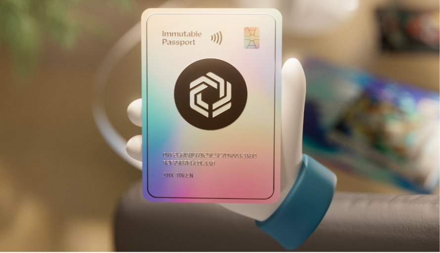
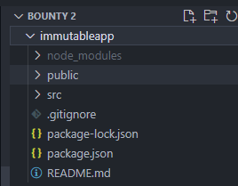

# Integrating Immutable Passport

In this guide, I will be showing you how to integrate immutable passport into your application. before diving into this guide, I will give you a brief introduction to Immutable Passport which one of the game changer in web 3 gaming and it benefits.

  ### Table of Content
  - <a href="#content1">Brief introduction to Immutable Passport</a>
  - <a href="#content2">Creating a simple application for Integrating Immutable Passport</a>
  - <a href="#content3">Registering the application on Immutable Developer Hub</a>
  - <a href="#content4">Installing and initialising the Immutable Passport client</a>
  - <a href="#content5">Logging in a user with Immutable Passport</a>
  - <a href="#content6">Displaying User Information</a>
  - <a href="#content7">Logging out a user</a>
  - <a href="#content8">Intiating transaction from Immutable Passport</a>

## <section id="content1">What is Immutable Passport</section>

Before we spotlight **Immutable Passport**, it is important to first understand the existing problems with wallets and the hurdles faced by game studios and players.

These gamers often find themselves baffled by the complex nature of crypto wallets - managing seed phrases, private keys, transaction signing and funding of wallets. Also, the constant need to sign each transaction for every in-game interaction disrupts the overall gaming experience which forces web3 games to often shift blockchain elements functionalities away from core gameplay.

Recognizing these hurdles, Immutable has developed Immutable Passport, the seamless wallet onboarding solution specifically designed and tailored for web3 games and players!


**Immutable Passport** is a blockchain-based identity and wallet system that caters to the needs of Web3 games. It offers a persistent identity that accompanies users across Web3 games, ensuring a consistent configuration across all applications.

**Immutable Passport** also comes equipped with a non-custodial wallet as a default option for each user, ensuring a transaction experience comparable to web2 standards. Immutable Passport being non-custodial, never takes custody of private keys! Users have full ownership and control over their private keys where only the user can access and manage the funds on their Immutable Passport.

## Benefits of Immutable Passport

The following are the key reasons why Immutable Passport should be integrated into games:

- Frictionless gamer onboarding
- Passport & Checkout Integration For Optimized Conversion
- Access to Games & Marketplaces

  ### Frictionless gamer onboarding
  Passport replaces the high friction of wallets like Metamask by eliminating 12 word keyphrases and replacing it with a simple social and email sign-in. This drastically lowers the UX friction, meaning that Passport is the most effective option to sign up players for user acquisition and pre-release registration. 

  #### Passport & Checkout Integration For Optimized Conversion
  For a more seamless experience, Immutable Passport is also integrated with the Checkout product, which ensures that whether a gamer is purchasing in-game assets or looking to fund their Passport from a bank account, the end-to-end experience from wallet creation to initiating a transaction remains seamless and user-friendly!

  ### Access to Games & Marketplaces
  Immutable Passport is not bound to a particular game or marketplace and travels with the user across the entire Immutable ecosystem unlike many of the current wallet solutions.
  
  This integration amplifies the reach of any item when a user lists for sale, making it across all integrated marketplaces. This not only enhances item visibility but also boosts overall trading liquidity for the listed item.

## <section id="content2">Creating a simple Application</section>
Let's get into the interesting aspect of the guide, we will be creating a react app, so make sure to have install <a href="https://nodejs.org/en/download" target="_blank">nodejs</a> on your machine. after installing nodejs run the command below to verify nodejs and npm has been installed.
```
node -v
npm -v
```
Next we generate a react boilerplate using the following command, to ensure we are follow along u may choose to use the same app name am using
```
npx create-react immutableapp
```



## <section id="content3">Registering the application on Immutable Developer Hub</section>
Next we are going to register our application on <a href="https://hub.immutable.com">Immutable Developer Hub</a>. signup or login to immutable hub depending on your situation.

Before using Passport, you must register your application as an OAuth 2.0 client in the Immutable Developer Hub. First, you'll need to create a project and a testnet environment. Then you can navigate to the Passport config screen and create a passport client for your created environment. When you're ready to launch your application on the mainnet, please ensure you configure a passport client under a mainnet environment.

**Note:** that can also use the default project which has been created for you.

Creating a client allows you to configure settings specific to your application, such as the permissions you require from users. It also grants you a set of credentials that you will need when initiating the login flow from your app.

An OAuth client needs to be registered for every type of application you own, so if you are a requires the Passport login in a mobile app and a website, you need to create two clients.

There are a few crucial details that must be provided when adding a client:

- Application Type:	The type of your application. Web or Native(mobile, desktop) applications.
- Client name:	The name you wish to use to identify your application.
- Logout URLs:	The URL that your users will be redirected to upon logging out of your application.
- Callback URLs:	The URL that your users will be redirected to once the authentication is complete. This is also where your application process the authentication response.

Once you have successfully registered your application in the Immutable Developer Hub. Be sure to make a note of your application's ```Client ID```, ```Callback URL``` and the ```Logout URL``` that you entered, as you will need these to initialise the Passport module in your application.

## <section id="content4">Installing and Initialising Immutable Passport </section>
Before you can begin using Passport, you must install the Immutable SDK and initialise the Passport Client. The SDK Passport Module enables games & third-party applications to leverage Immutables authentication and wallet functionalities.

### Prerequisites 
The Immutable SDK requires Node v18 (Active LTS version) or higher. Node v18 can be installed via ```nvm``` which allows to quickly install and use different versions of node via the command line.

The installation steps for ```nvm``` for Linux, Mac, and Windows Install & Update Script. You are now ready to install the Node LTS version:

```
nvm install --lts
```

### Install the Immutable SDK
Run the following command in your project root directory.

```
npm install -D @imtbl/sdk
```

### Dependencies
```
npm install -D typescript ts-node
```

### Trouble Shooting
The Immutable SDK is still in early development. Should complications arise during the installation, please use the following commands to ensure the most recent release of the SDK is correctly installed:
```
rm -Rf node_modules
npm cache clean --force
npm i
```
## Initializing Immutable Passport Client
Next, we'll need to initialise the Passport client. The Passport constructor accepts a PassportModuleConfiguration object, copy the code below and paste to App.js
```
import { config, passport  } from '@imtbl/sdk';

const passportInstance = new passport.Passport({
  baseConfig: new config.ImmutableConfiguration({
    environment: config.Environment.PRODUCTION,
  }),
  clientId: '<YOUR_CLIENT_ID>',
  redirectUri: 'https://example.com',
  logoutRedirectUri: 'https://example.com/logout',
  audience: 'platform_api',
  scope: 'openid offline_access email transact'
});
```
Since we are working with reactjs replace ```redirectUri``` with and logoutRedirectUri with localhost:3000 and  localhost:3000/logout respectively.

### Parameters
baseConfig: An instance of an ImmutableConfiguration, which defines shared configuration across all the Immutable modules, such as the environment.

cliendId: The unique identifier of the application that was registered in the Immutable Developer Hub.

redirectUri: The URI of your application that users will be redirected to after successfully authenticating. This value must match one of the Callback URLs that have been set against your client in the Immutable Developer Hub.

logoutRedirectUri: The URI of your application that users will be redirected to after successfully logging out. This value must match one of the Logout URL's that have been set against your client in the Immutable Developer Hub.

audience: A string containing the audience(s) that the issued token is intended for, with each audience being separated by a space. Passport currently supports the following audiences:

- platform_api: The identifier for the Immutable protocol APIs.

**Note**: The ```platform_api``` audience is required in order to interact with the Immutable protocol.

scope: A string containing the scope(s) that specify what access privileges are being requested, with each scope being separated by a space. The following custom scopes are supported:

- transact: Allows the authenticating application to interact with the users Passport wallet.
In addition to the above, the following standard OpenID Connect (OIDC) scopes are strongly recommended:

- openid: Informs the Authorization Server that the client is making an OpenID connect request. Without this scope, users will not be able to authenticate.
- offline_access: Requests that an OAuth 2.0 Refresh Token be issued. The Refresh Token is used by Passport during registration to initialise the user's wallet. Without this scope, user registration and a number of other operations will fail.
- email: Requests that the client gains access to the users email address. Without this scope, the users email address will not be available to the client.

**Note**: The transact, openid & offline_access scopes are all currently required to correctly interact with Passport.

**Note that the Passport constructor may throw the following error**:

Error Code: **INVALID_CONFIGURATION**	

Cause: The environment configuration or OIDC Configuration is incorrect

Resolution: Verify that you are passing an environment configuration and OIDC configuration, and that all the mandatory properties have been set

## <section id="content5">Logging a user with Immutable Passport</section>
